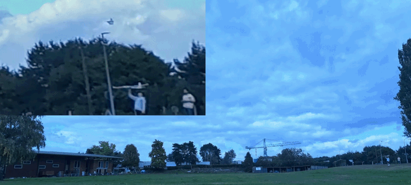
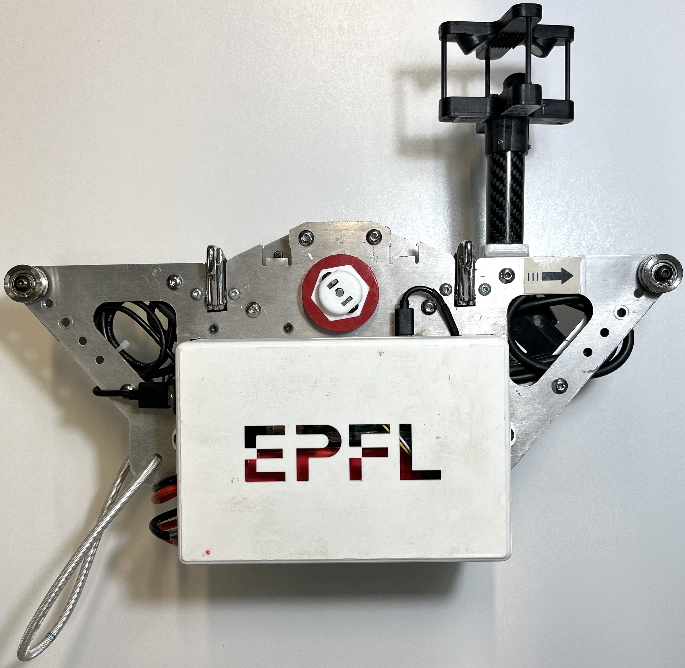
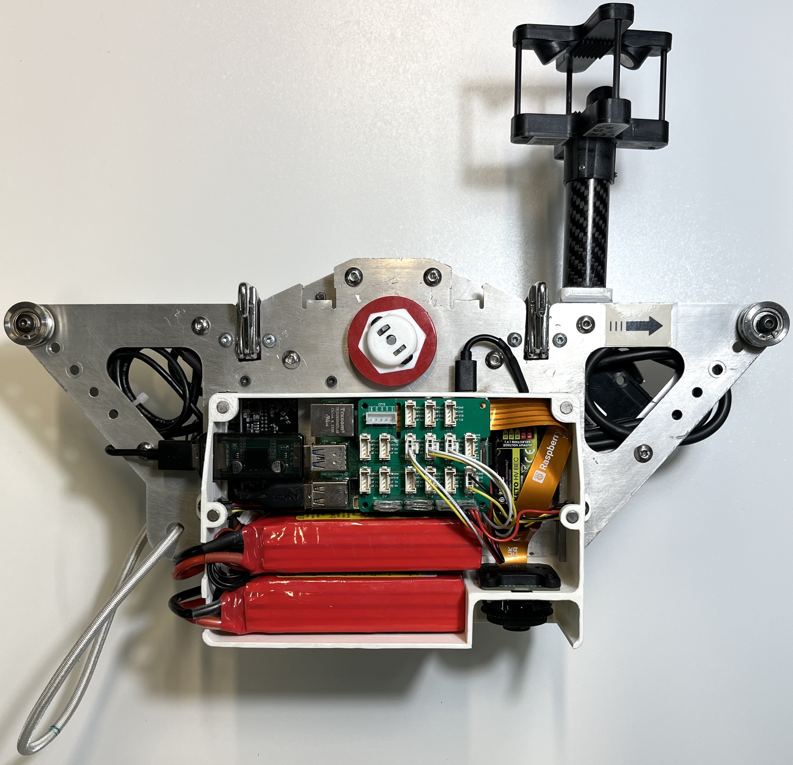
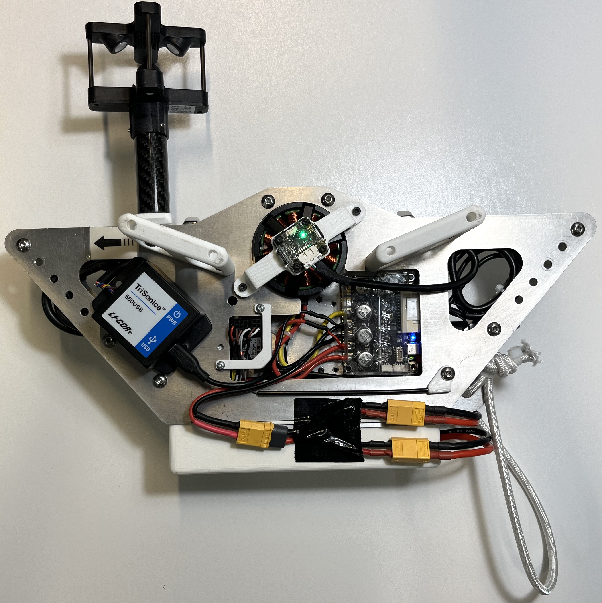
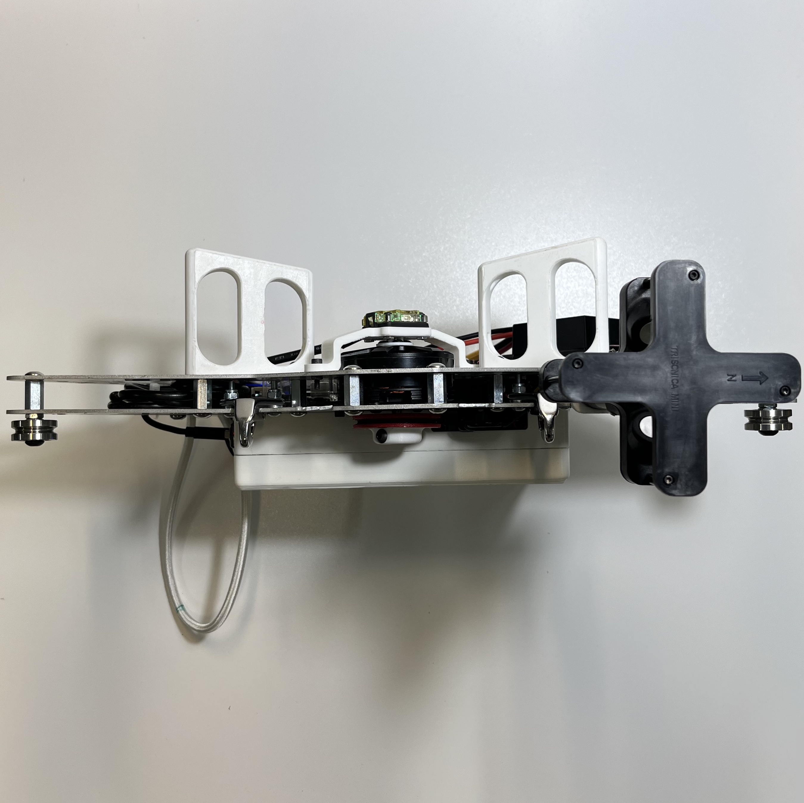
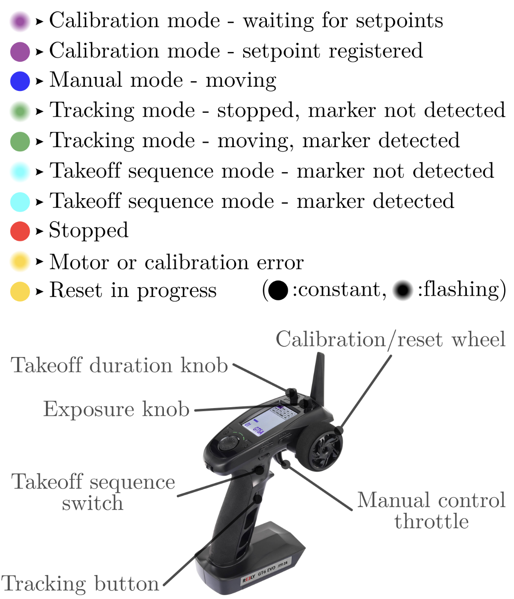
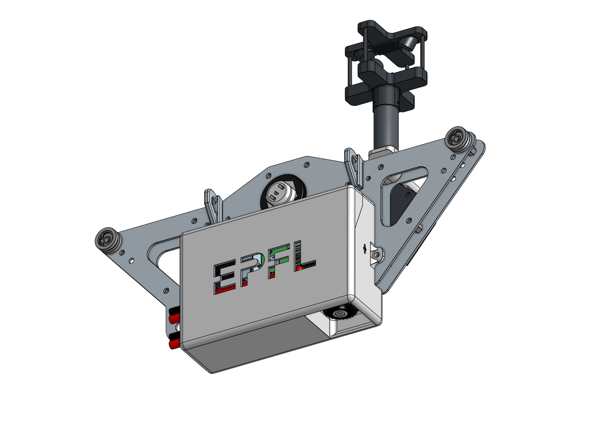

# Winged Aircraft Safety Platform for Outdoor Flight

Outdoor flight tests of experimental winged drones can be risky because, contrary to rotorcraft, winged drones cannot rapidly transition to a safe hover state after a malfunction, during early learning stages, or external disturbances. Existing safety approaches, including wind-tunnel confinement and onboard parachute systems restrict the flight envelope and can be impractical for lightweight drones. We present the Winged Aircraft Safety Platform (WASP), a motorized, cable-guided robotic system designed to enable safe, tethered outdoor flight tests of winged drones. WASP consists of an motorized support system with a safety tether and onboard camera to track and follow the drone along a suspended horizontal line in order to prevent ground impacts.
WASP also serves as a data-collecting device that integrates encoder-based motion sensing, vision-based pose estimation, and real-time three-dimensional wind measurements to provide full drone state information, including position, velocity, attitude, airspeed, angle of attack, and sideslip angle. Outdoor experiments conducted over a 70 m cable show stable tracking at speeds up to 14 m/s with accelerations of 8 m/s². WASP can be used for outdoor experiments with new control methods, drone designs, and data collection campaigns for machine learning methods.

<p align="center">
  
</p>

${\color{red} \text{add link to youtube video}}$


## Hardware setup

The full [CAD model](https://cad.onshape.com/documents/e720400fb6a2299e38239c2c/w/06ed2a46215f6c75c633ae7b/e/eed919d2f4453d865657b7de?renderMode=0&uiState=69c156d5e8c5edb76eb85b28) of the WASP is available on
Onshape. 
The robot structure is primarily made from 2 mm folded aluminum sheets, while the custom functional parts are 3D-printed in [PLA](https://ultimaker.com/materials/s-series-tough-pla/). 
The outer ring of the drive wheel is printed in [TPU](https://ultimaker.com/materials/s-series-tpu-95a/), which provides friction between the drivetrain and the 2 mm diameter
steel cable. Because this TPU layer gradually wears out after repeated
runs, it may need to be replaced occasionally.
Without listing all standard hardware components such as screws, nuts,
bearings, hooks, and magnets, the main elements of the system are
summarized below:

<div align="center">

| | | |
|---|---|---|
| [ODrive S1](https://eu.odriverobotics.com/shop/odrive-s1) | [Raspberry Pi 5](https://www.raspberrypi.com/products/raspberry-pi-5/) | [GT6 EVO Radio Controller](https://www.conrad.ch/fr/p/reely-gt6-evo-radiocommande-a-poignee-pistolet-2-4-ghz-nombre-de-canaux-6-avec-recepteur-1780646.html) |
| [ODrive Encoder OA1](https://eu.odriverobotics.com/shop/odrive-encoder-oa1-on-axis-magnetic-encoder-with-rs485) | [Raspberry Pi Global Shutter Camera](https://www.raspberrypi.com/products/raspberry-pi-global-shutter-camera/) | [NeoPixel LEDs](https://www.adafruit.com/product/1312) |
| [ODrive Motor D5312s 330KV](https://eu.odriverobotics.com/shop/dual-shaft-motor-d5212s-300kv) | [TriSonica LI-550](https://www.licor.com/products/trisonica/LI-550-mini?category=Meteorology) | [4S LiPo Battery](https://www.galaxus.ch/en/s5/product/nvision-lipo-battery-148v-2500mah-35c-1480-v-2500-mah-rc-batteries-7946624) |
| [ODrive USB Isolator](https://eu.odriverobotics.com/shop/usb-isolator) | [TriSonica USB Adapter](https://www.licor.com/products/trisonica/accessories) | [MTTEC Keto HV BEC](https://www.mttec.de/MTTEC-KETO-HV-BEC-12s-10A-20A-Peak-V2) |

</div>

Once fully assembled, the platform looks as follows:

<table align="center">
  <tr>
    <td align="center"></td>
    <td align="center"></td>
  </tr>
  <tr>
    <td align="center"></td>
    <td align="center"></td>
  </tr>
</table>


## Software setup and calibration

### SSH connection

1. Connect the Raspberry Pi to a Wi-Fi network. For outdoor use, a
   smartphone hotspot is recommended. This initial setup requires a
   screen, keyboard, and mouse connected to the Raspberry Pi.

2. Connect a laptop to the same network, then access the Raspberry Pi
   via SSH:

    ```bash
    ssh lis25@raspberrypi.local
    ```

    (Once the Raspberry Pi reconnects automatically to the same hotspot,
    it can be used as a standalone system without a screen, keyboard, or
    mouse.)

3.	Optional: in VS Code on your laptop, use the Remote SSH
extension for easier access to the Raspberry Pi files and code.


### Installation

1. From the Raspberry Pi (accessed through SSH), clone this repository to
the desired location. For the installation steps below, a wired
internet connection is recommended if available. 
    ```
    git clone https://github.com/your-username/safe-outdoor-flight.git
    ```

2. Navigate to the project directory, create a virtual environment, and activate it.
    ```
    cd Documents/safe-outdoor-flight
    python -m venv venv
    source venv/bin/activate 
    ```

3.	Install the project dependencies:
    ```
    pip install -r requirements.txt
    ```

### Camera calibration

1. Print the calibration checkerboard located at `src/camera_calib/checker_200x150_5x8_24.pdf`.

2. Run the following command and move the checkerboard in front of the
camera so that it covers as much of the field of view as possible.
For more details, see the [OpenCV documentation](https://docs.opencv.org/4.x/dc/dbb/tutorial_py_calibration.html).
    ```
    python3 camera_ctrl.py calibrate_camera
    ```

3. Once calibration is complete, the file `src/camera_calib/calib_data/calib_data.npz` is generated and can be used to undistort the captured images.

    *If you encounter some issues with the camera, the following resources may be helpful: [[1]](https://datasheets.raspberrypi.com/camera/picamera2-manual.pdf), [[2]](https://forums.raspberrypi.com/viewtopic.php?t=361758).*
  

### Motor calibration

1.	Run the following command on the Raspberry Pi to install the ODrive
USB device rules, grant non-root access permissions, and allow Python
to communicate with the ODrive without using sudo:
    ```
    sudo bash -c "curl https://cdn.odriverobotics.com/files/odrive-udev-rules.rules > /etc/udev/rules.d/91-odrive.rules && udevadm control --reload-rules && udevadm trigger"
    ```

2.	Make sure the motor shaft, magnet, and encoder are properly aligned,
and that there is no mechanical play in the assembly.

3.	Power the ODrive S1 from an external battery, connect it to the
laptop via the USB isolator, open the [ODrive GUI](https://gui.odriverobotics.com/configuration), and follow the calibration procedure. Using [Google Chrome](https://www.google.com/intl/en_us/chrome/) is recommended for this step. For more details, refer to the [ODrive documentation](https://docs.odriverobotics.com/v/latest/index.html).


## Operating Procedure

This section describes how to deploy the WASP system and run a tracking experiment.


### Prepare the ArUco marker

1. Print the ArUco marker located at: `src/camera_calib/DICT_4X4_50_ID_7_SIZE_400px.png`.

2. Attach the marker to the UAV that the WASP should track.

    *If you want to generate a different marker, see the `generate_markers()` function in `camera_ctrl.py`.*


### Start a persistent SSH session

On the laptop connected via SSH to the WASP, create a
[`tmux`](https://github.com/tmux/tmux/wiki) session so the program can keep running even if the SSH connection drops:
```bash
tmux
```
If you become detached from the session, reattach with:
```
tmux a -t0
```


### Launch the control software

Place the WASP on the cable and run:
```
python3 main.py
```
When the program starts, the system enters calibration mode.


### Cable calibration

The WASP must first learn the limits of the cable on which it moves.

<table>
<tr>
<td width="60%" valign="top">

1. Set the maximum position: move the WASP to the far end of the cable (maximum position you want it to reach) using the remote throttle. Then turn the calibration wheel clockwise to its maximum position. This registers the end setpoint of the cable.

2. Set the minimum position: move the WASP to the opposite end of the cable (minimum position).
Then turn the calibration wheel counter-clockwise to its minimum position. This registers the start setpoint of the cable.

3. The system prints the calibrated cable distance in the terminal. At this point the WASP LEDs switch from purple (calibration mode) to red (stopped), indicating that the calibration has been successfully completed. When defining these boundaries, it is recommended to leave a small safety margin on both sides to account for possible overshoot caused by tire wear or insufficient cable tension. Calibration data is saved to: `src/zipline_calib/zipline_YYYY_MM_DD.csv`

</td>

<td width="40%" valign="middle">



</td>
</tr>
</table>

If another flight is performed on the same day, the saved calibration can be reused. To do so, move the WASP directly to the start of the cable and set only the start position (turn calibration wheel counter-clockwise). Setting a new end position will overwrite the previously saved calibration.


### *Optional: Assisted takeoff mode*

During hand launch, the UAV may accelerate faster than the perception pipeline can react.
To address this, a dedicated takeoff sequence is implemented. In this mode:

- the WASP first performs a short back-and-forth motion to allow the operator to synchronize the launch (3 times),
- it then accelerates automatically to a user-defined velocity (4th back-and-forth motion),
- once this velocity is reached, the controller automatically transitions to normal tracking mode.

This mode can be activated using the dedicated switch on the remote controller.


### *Optional: Tuning takeoff and exposure parameters*

If the assisted takeoff duration appears incorrect, or if the ArUco detection becomes inconsistent, the relevant parameters can be tuned using the dedicated knobs on the remote controller.


### *Optional: Logging multiple runs*

When the program is terminated, all recorded data are automatically saved as `.csv` files. If multiple runs are required without stopping the program, the calibration/reset wheel can be used to start a new log file. When not in calibration mode, turning the wheel to its minimum or maximum position will save the current dataset to `.csv` files and create new files for the upcoming run.


### *Optional: Launching a drone*

The WASP can also be used to launch a drone at a defined speed. To do so, print the launcher module (${\color{red} \text{add link to launcher module}}$) and use it to clip the drone into the WASP. The servo will then detach the drone at the end of the takeoff maneuver.

<p align="center">
  
</p>


## Data Analysis

After each run, the system automatically saves the recorded data in the following files:

- `data/run_YYYY-MM-DD_HH-MM-SS/data_YYYY-MM-DD_HH-MM-SS.csv`: containing encoder measurements and vision-based tracking data,

- `data/run_YYYY-MM-DD_HH-MM-SS/wind_data_YYYY-MM-DD_HH-MM-SS.csv`: containing all measurements from the wind sensor.

To analyze a run, the script `utils/run_analysis.py` can be used. This script:

- merges the encoder, vision, and wind sensor datasets,
- computes the **airspeed**, **angle of attack**, and **angle of sideslip** of the tracked UAV,
- generates plots of the relevant flight data for post-flight analysis.


## Acknowledgements
- **Authors:** Cyril Goffin & Simon Jeger
- **Affiliation:** [Laboratory of Intelligent Systems (LIS)](https://www.epfl.ch/labs/lis/), EPFL
- **Publication:** [Winged Aircraft Safety Platform (WASP) Enables Safe Outdoor Flight Test](docs/Winged_Aircraft_Safety_Platform_(WASP)_Enables_Safe_Outdoor_Flight_Test.pdf)